  

###

<h1 align="center">Hi, I'm Franco Avaro

</h1>

###

<h2 align="left">
  <picture>
    
  </picture> 
  About Me
</h2>

###

  I'm a student from Bolivia 
   , 
  currently studying at Univalle in Santa Cruz. 
  - 🎓 I’m pursuing a degree in Computer Systems Engineering. 
  - 🎵 I enjoy walking, listening to music, and working out at the gym. 
  - 🌱 I’m always looking to learn and grow in technology and development. 
  - 🤖 I’m passionate about Artificial Intelligence and love exploring its endless possibilities every day.

###

<h2 align="left">🛠 Language and Tools</h2>

###

  
  
  
  
  
  
  
  
  
  
  
  
  
  
  
  

###

<h2 align="left">
  <picture> 
      
  </picture>
  Github Stats
</h2>

###

  
  

###
